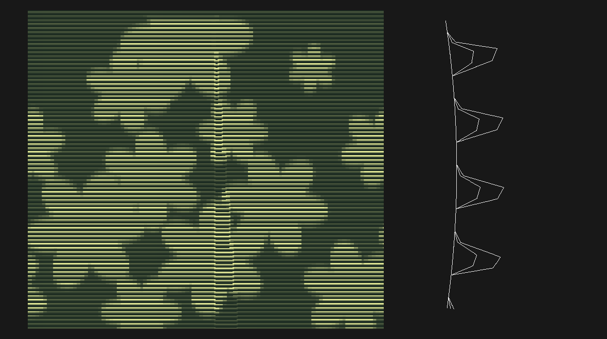
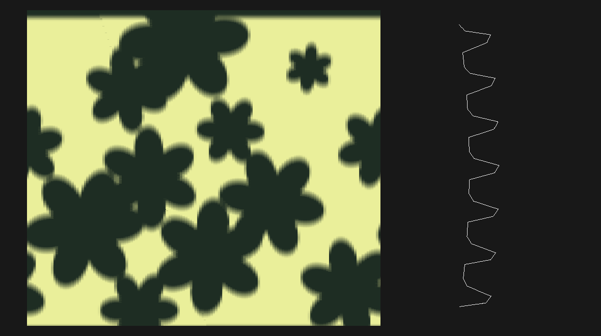

# fullcontrol-lamparas

Lámparas paramétricas impresas en 3D, generadas escribiendo G-code directamente
con [FullControl](https://github.com/FullControlXYZ/fullcontrol).

Pensado para una **Bambu Lab A1 con boquilla de 0.8 mm**, imprimiendo en modo
vaso (spiral) con capas de 0.4 mm.

---

## ⚠️ AVISO IMPORTANTE ANTES DE IMPRIMIR

El G-code que sale de acá **ya incluye start y end gcode para la A1**
(`lamparas/impresoras.py`), así que es imprimible tal cual. Pero esa secuencia
**la escribí a mano con comandos estándar, NO es el start gcode de fábrica de
Bambu Studio.**

Qué **sí** hace:

- calentar cama y boquilla, y esperar
- homing (`G28`)
- nivelación de cama (`G29`) — se puede desactivar con `--sin-nivelacion`
- dos líneas de purga en el borde frontal de la cama, con retracción y salto de Z
- ventilador de capa
- al terminar: retraer, separar la boquilla, adelantar la cama, apagar todo

Qué **no** hace (y sí hace Bambu Studio):

- **cargar el primer filamento desde el AMS.** El start gcode de acá asume que
  ya hay filamento cargado. Los cambios *a media pieza* sí manejan el AMS
  (`--cambio-ams`, más abajo), pero el primero corre por tu cuenta: o cargás el
  slot a mano desde la pantalla, o usás el start gcode real de Bambu Studio.
- calibración de flujo, de linear advance ni compensación de vibraciones
- la rutina de limpieza de boquilla propia de la A1

**Lo más seguro es usar el start/end gcode real de tu A1.** Se saca de Bambu
Studio (*Ajustes de impresora → Machine G-code → Machine start/end G-code*), se
guarda en un archivo y se pasa así:

```bash
python -m lamparas.twist --start-gcode a1_start.gcode --end-gcode a1_end.gcode
```

En ese caso las temperaturas las fija tu start gcode, no el nuestro.

**Siempre**, uses el bloque que uses: previsualizá el `.gcode` antes de
imprimir (ver más abajo, o un visor tipo [gcode.ws](https://gcode.ws)) y
**quedate mirando la primera capa**.

### Cómo se lo pasás a la impresora

Por **microSD**: archivo en la raíz de la tarjeta (no en subcarpetas), nombre
alfanumérico sin acentos, y desde la pantalla de la A1 *File* → seleccionarlo →
*Print*.

No sirve mandarlo desde Bambu Studio ni desde Orca Slicer: los dos son slicers,
esperan una malla y para Bambu usan el mismo plugin de red que exige un `.3mf`
laminado por ellos. Un `.gcode` crudo lo rechazan. Donde Orca sí sirve es como
**visor**: abrí el archivo generado y revisá capa por capa antes de imprimir.

Las coordenadas se centran por defecto en `(128, 128)`, el centro de la cama de
256×256 mm de la A1. Si cambiás de impresora, ajustá `Perfil.centro` y
`Perfil.tamano_cama` (el generador avisa por consola si la pieza no entra).

---

## Qué es FullControl

FullControl es una librería de Python que permite **diseñar la trayectoria de
impresión directamente**, sin pasar por un modelo 3D ni por un slicer.

El flujo normal es `CAD → STL → slicer → gcode`: el slicer decide cómo rellenar
el sólido y uno solo controla parámetros globales. Con FullControl uno describe
una lista de "pasos" (puntos, cambios de velocidad, temperaturas, extrusor
on/off) y esa lista *es* el recorrido de la boquilla, punto por punto.

Para lámparas en modo vaso esto es ideal: la pieza es literalmente una sola
espiral continua, así que definirla como una función matemática del ángulo y la
altura es mucho más directo (y más fácil de parametrizar) que modelarla en CAD.

La contrapartida es la del aviso de arriba: al no haber slicer, tampoco hay
start/end gcode de la impresora.

**Para entender cómo se escribe un diseño en FullControl** hay un tutorial
corto en [`docs/fullcontrol.md`](docs/fullcontrol.md): el modelo de la lista de
pasos, cómo se calcula la extrusión, los helpers de geometría y los errores
típicos.

---

## Instalación

```bash
git clone <este-repo> fullcontrol-lamparas
cd fullcontrol-lamparas

python3 -m venv venv
source venv/bin/activate          # en Windows: venv\Scripts\activate
pip install -r requirements.txt
```

---

## Cómo correr un script

Cada diseño vive en `lamparas/` y se puede ejecutar como módulo:

```bash
# valores por defecto (radio 40, altura 150, 6 lóbulos, 1.5 vueltas de twist)
python -m lamparas.twist

# lámpara más ancha, más baja y con más torsión
python -m lamparas.twist --radio-base 55 --altura 120 --n-ondas 8 \
                         --amplitud 6 --vueltas-twist 3 --nombre lampara_alta

# ver todas las opciones
python -m lamparas.twist --help
```

El `.gcode` queda en `output/` (esa carpeta está en `.gitignore`).

---

## Cómo ver cómo quedaría

```bash
# genera el .gcode Y un HTML 3D interactivo en output/
python -m lamparas.twist --preview

# solo la previsualización, sin exportar gcode (para iterar rápido)
python -m lamparas.twist --solo-preview --n-ondas 12 --amplitud 8 --vueltas-twist 4

# visor propio de FullControl: simula el ancho y alto real de cada línea
python -m lamparas.twist --plot
```

`--preview` deja un `output/<nombre>.html` autocontenido (plotly embebido, no
necesita internet) que se abre con doble clic en cualquier navegador y se puede
rotar y hacer zoom. Dibuja también el contorno de la cama, así se ve de una si
la pieza entra. Funciona sin entorno gráfico, así que sirve por SSH o en un
contenedor.

`--plot` abre el visor de FullControl, que es más fiel (simula el grosor real
de la línea extruida) pero mucho más pesado y necesita un navegador en la misma
máquina.

### Loop en vivo con gcode-preview (VS Code)

La extensión que está en `../../gcode-preview` puede quedarse mirando `output/`
y previsualizar siempre el gcode más nuevo. Sirve para iterar parámetros sin
regenerar un HTML de 4 MB por vuelta, y trae dos cosas que el preview de acá no
tiene: **slider de capas** y **mapa de calor de voladizo** medido sobre el
recorrido real.

1. En VS Code, click derecho sobre `output/` → **"G-code: Watch Folder
   (preview newest)"**. La carpeta puede no existir todavía.
2. `python -m lamparas.bowls celosia --altura 70` — el panel se actualiza solo.
3. Cambiás parámetros, volvés a correr. Cada corrida reemplaza la vista.

Por eso `guardar_gcode()` escribe de forma atómica (`.gcode.tmp` + rename): el
watcher se despierta con el primer byte y si no, leería un archivo a medio
escribir.

**Ojo con el mapa de calor en los calados.** Su métrica es "¿hay pared una capa
más abajo, a menos de 3 mm?", así que una `celosia` le va a salir roja entera —
y es exactamente lo que el diseño busca. Para el calado el chequeo que vale es
el `_verificar_apoyo()` de `comun.py`, que pide contacto en *algún* punto de la
vuelta y no en todos. En las siluetas lisas y en `cesta`/`malla`/`tramado` sí
coinciden las dos mediciones.

Desde código:

```python
from lamparas.preview import guardar_html
from lamparas.twist import pasos_lampara_twist

pasos = pasos_lampara_twist(n_ondas=12, amplitud=8)
print(guardar_html(pasos, "prueba_12_lobulos"))
```

También se puede usar como librería:

```python
from lamparas import Perfil
from lamparas.twist import generar_lampara_twist

perfil = Perfil(diametro_boquilla=0.6, altura_capa=0.3, temp_boquilla=215)

gcode = generar_lampara_twist(
    radio_base=45,
    altura=180,
    n_ondas=10,
    amplitud=5,
    vueltas_twist=2.0,
    perfil=perfil,
    nombre="lampara_10_lobulos",
)
```

---

## Estructura del proyecto

```
lamparas/
  comun.py       # Perfil de impresión, generador de espiral, exportación de gcode
  impresoras.py  # start/end gcode de la A1 (o el tuyo, desde un archivo)
  colores.py     # cambios de filamento: pausa manual y AMS
  superficie.py  # máscaras: qué se dibuja sobre la pared, y dónde
  cordon.py      # qué le hace el CORDÓN a un relieve angular (cuánto sobrevive)
  preview.py     # previsualización HTML 3D
  twist.py       # lámpara ondulada con twist progresivo
  bowls/         # bowls con patrones tejidos
    siluetas.py  # formas de la pared: bol, copa, platillo, campana
    cesta.py     # trenzado de cestería
    malla.py     # malla fina de rombos
    celosia.py   # calado real, con agujeros pasantes
    tramado.py   # entramado diagonal
    zigzag.py    # textura de diente de sierra que dibuja una máscara
    ondas.py     # anillos horizontales ondulados, tipo cerámica torneada
    puas.py      # turupes: la boquilla sale y entra; donde sale, dibuja
    peine.py     # líneas verticales finas; el dibujo lo hacen las que sobresalen
  cordon.py      # qué le hace el cordón a un relieve angular (cuánto sobrevive)
verificar_ams.py # compara el cambio de AMS contra un .3mf real de Bambu Studio
verificar_lineas.py # mide sobre el g-code cuánto del relieve sobrevive al cordón
test_cordon.py   # banco de pruebas del modelo del cordón
verificar_continuidad.py # ¿el trazo es UNA línea? sin viajes ni retracciones, la Z sube
vista_relieve.py # la pieza DESENROLLADA a PNG: para ver el dibujo antes de imprimir
output/          # .gcode y .html generados (gitignored)
requirements.txt
```

---

## Bowls con patrones tejidos

Cuatro patrones, cuatro siluetas, se combinan entre sí. Ninguno se puede hacer
con un slicer: el patrón cambia dentro de cada vuelta y de una vuelta a la otra.

```bash
python -m lamparas.bowls malla --preview
python -m lamparas.bowls cesta --altura 70 --radio-boca 85 --p n_tiras=20
python -m lamparas.bowls celosia --silueta platillo --radio-max 90 --solo-preview
python -m lamparas.bowls tramado --p torsion=14 --p amplitud=2.5 --nombre bowl_diagonal
python -m lamparas.bowls --help
```

| patrón | qué hace | cómo |
|---|---|---|
| `cesta` | tejas horizontales alternadas, tipo cestería | onda radial cuya fase se invierte entre bandas de capas, con envolvente seno |
| `malla` | malla fina de rombos | onda radial con **medio lóbulo de más por vuelta**: las crestas de una vuelta caen en los valles de la anterior |
| `celosia` | calado real, con agujeros pasantes | la **Z** ondula dentro de la vuelta; las vueltas se tocan solo en los nodos |
| `tramado` | entramado diagonal trenzado | dos familias de hélices opuestas combinadas con `max()`, así una tira pasa por encima de la otra |
| `rizos` | bucles que sobresalen, tipo candelero "Dream of Glow" | trocoide: el trazo **retrocede** en ángulo y cierra un bucle, en vez de solo ondular |
| `zigzag` | textura en diente de sierra que **dibuja una figura** sobre la pared | el radio va y viene en triángulo dentro de la vuelta, y la vuelta siguiente va lisa. Solo donde una máscara lo pide |
| `ondas` | anillos horizontales ondulados, tipo cerámica torneada | el radio ondula con la **altura**, no con el ángulo; y la fase corre con el ángulo, así los anillos suben y bajan al dar la vuelta |
| `puas` | el dibujo lo hacen los **turupes**: la boquilla sale y entra en toda la pared, y en la figura sale más | la onda va sólo hacia AFUERA y todas las vueltas pulsan en la misma fase, así que las púas se apilan en columnas. Se alternan vueltas lisas y vueltas con patrón, y el grumo crece a lo largo de su banda para que apoye |
| `peine` | líneas verticales finas en **toda** la pared; el dibujo lo hacen las que sobresalen más | un diente por línea, con el número de dientes por vuelta ENTERO para que se apilen en columna. La máscara elige, línea por línea, si le toca la altura de fondo o la del dibujo |

Los parámetros propios de cada patrón van con `--p clave=valor` (repetible) y
están documentados en el `construir()` de cada módulo.

**Siluetas** (`--silueta`): `bol` (por defecto), `copa` (cónica), `platillo`
(panza y boca cerrada), `campana`, `candelero` (acampanado con cuello),
`cilindro` (recto — es la de una matera, y la que no tiene nada de voladizo). Se
ajustan con `--radio-base`, `--radio-boca` y `--radio-max`.

El candelero de las referencias sale así:

```bash
python -m lamparas.bowls rizos --silueta candelero --altura 90 \
       --radio-base 45 --radio-boca 14 --preview
```

### Rizos: qué hace falta para que sea un bucle y no una onda

Una onda entra y sale del radio pero el ángulo siempre avanza. Para que el
trazo se cierre sobre sí mismo tiene que **retroceder** en ángulo, y eso lo da
`funcion_dangulo` en `generar_pieza()`. La curva es una trocoide, y solo cierra
el bucle si la amplitud supera `radio / n_rizos`. Por debajo de eso queda una
pared ondulada; el módulo lo calcula y avisa.

### Ancho de línea

`--ancho-linea` está separado de `--boquilla`: la boquilla es el hardware, el
ancho es cuánto plástico se empuja. Se puede pedir hasta ~2x la boquilla para
una pared más gruesa y opaca. Si no se especifica, se usa el de la boquilla.

### Dos cosas que estos diseños resuelven y conviene entender

**Base sólida.** Un bowl necesita piso, y el modo vaso es un trazo continuo sin
saltos. `generar_pieza(base_solida=True)` rellena el fondo con una espiral de
Arquímedes desde el centro hacia afuera y sigue de largo con la pared, sin
cortar la extrusión. Con `--sin-base` queda abierto abajo (pantalla de lámpara).

**Paso vertical de la celosía.** Es el detalle no obvio del calado. Si la Z
ondula ±0.7 mm pero la pieza sube solo 0.4 mm por vuelta, la cresta de una
vuelta queda 1 mm *por debajo* del valle de la anterior: la boquilla vuelve a
bajar sobre material ya impreso. Por eso `celosia` sube `2 * amplitud_z` por
vuelta en vez de una altura de capa, y usa `solape` para dejar una mordida
controlada de ~0.2 mm en los nodos, que es lo que los suelda.

## Cambiar de filamento a media pieza

La idea: parar, meter el filamento nuevo y seguir **sin purgar**. Lo que quedaba
del color viejo en la zona de fusión sale mezclado con el nuevo durante las
primeras vueltas, y esa mezcla es el efecto.

```bash
# pausa manual a 20 y a 40 mm: la impresora para, cambiás el rollo y reanudás
python -m lamparas.bowls cesta --altura 60 --cambio 20 --cambio 40

# cambio de slot del AMS: a 20 mm pasa al A3 (PETG) y a 40 mm vuelve al A1
python -m lamparas.bowls cesta --altura 60 \
       --slot-inicial 1:PLA --cambio-ams 20:3:PETG --cambio-ams 40:1:PLA

# la lámpara twist acepta las mismas opciones
python -m lamparas.twist --altura 150 --cambio-ams 50:2 --cambio-ams 100:3
```

**`--cambio` usa `M400 U1`**, el comando nativo de pausa de Bambu (M600 no
existe en estas máquinas). No toca el AMS y no depende de ningún comando
propietario. Para dos o tres colores por zonas es todo lo que hace falta, y es
lo único que sirve si no tenés AMS.

**`--cambio-ams` maneja el AMS**. El slot va **1..4, como lo rotula el AMS**
(en el gcode sale como `T0`..`T3`; el generador imprime la equivalencia para que
no haya dudas). El material es opcional y sale de la tabla de `colores.py`;
define las temperaturas y el caudal con los que se hace el cambio.

`--slot-inicial` dice con qué filamento arranca la pieza. No es cosmético: la
**descarga** de cada cambio se hace a la temperatura y al caudal del filamento
que *sale*, no del que entra. Descargar PETG a 240 °C en vez de a 270 lo deja
pegado en el fusor.

### De dónde salen los comandos del AMS

Bambu no documenta los comandos del AMS, así que esto no se puede escribir de
memoria: **se calca del gcode que produce el slicer**. El bloque de acá está
sacado de `gcodes/multi_color_cube.gcode.3mf` — un cubo de dos colores laminado
por Bambu Studio 02.06.00.51 para una A1 con boquilla de 0.8 — y de la
plantilla `change_filament_gcode` que ese archivo trae en la cabecera, rotulada
`;===== A1 20251031 =====`.

Ese archivo tiene 64 cambios de filamento. `verificar_ams.py` genera el bloque
para cada uno de esos 64 pares de filamentos y lo compara comando por comando
con el que emitió Bambu Studio:

```bash
python verificar_ams.py
# multi_color_cube.gcode.3mf: 64 cambio(s) de filamento, boquilla 0.8 mm.
#   cambio #1: A1 (PLA) -> A3 (PETG), 71 comandos ... OK
#   ...
# Todo calcado.
```

Los 71 comandos coinciden en los 64 bloques. Las dos únicas diferencias son a
propósito:

- **`M9833 F...`**, el caudal de referencia de la compensación dinámica de
  extrusión: el slicer pone el de su perfil, nosotros el de la pieza que
  estamos generando de verdad.
- **la vuelta a la pieza**, que el slicer no nos regala (ver abajo).

Conviene volver a correrlo cuando salga una versión nueva de Bambu Studio, o
contra un `.3mf` tuyo: `python verificar_ams.py mi_export.gcode.3mf`.

### Lo que el slicer no nos da: volver a la pieza

Cuando termina el cambio, el cabezal quedó en el limpiador (X-48.2, **fuera de
la cama**) y 3 mm por encima de lo impreso. En un gcode laminado eso no importa
porque el slicer ya sabe cuál es el próximo movimiento. Acá sí importa: si se
dejara ahí, el siguiente movimiento de FullControl sería una línea
**extruyendo** desde el limpiador hasta la pieza, cruzando la cama entera.

Por eso el bloque de cambio no es una cadena fija sino una función que recibe
el último punto impreso, y termina viajando de vuelta a él —primero en XY
estando alto, después bajando la Z— antes de cebar. Es también el motivo de que
`generar_pieza(cambios=...)` acepte callables además de cadenas.

### Dos cosas que hay que reponer al volver

El bloque emite sus propias `F` y apaga el ventilador, y ninguna de las dos se
restaura sola.

**La velocidad.** La última `F` del bloque es la de la retracción de cebado,
F1800. FullControl no vuelve a emitir `F` nunca, porque solo lo hace cuando la
velocidad *cambia* y para él nunca cambió — así que sin reponerla, **todo lo
que se imprime después del primer cambio sale a F1800** en vez de a la
velocidad pedida, y no se recupera en el resto de la pieza. En un patrón calado
eso es la diferencia entre que el cordón cuaje y que no. El bloque termina con
un `G1 F<velocidad>` explícito, y repone la que estaba vigente en ese punto del
recorrido: si un `--velocidad-en 10:600` la bajó antes, repone 600, no la del
perfil.

**El ventilador**, que el cambio apaga (`M106 P1 S0`) y se repone al valor de
`Perfil.ventilador`.

El viaje de vuelta va a **F42000**, la velocidad de viaje de la máquina, no la
del perfil. Son 180-300 mm cruzando por encima de la pieza con la boquilla
recién cargada y caliente: cuanto menos tiempo pase ahí arriba, menos gotea.

### Los viajes que se ven en el preview

Un cambio son ~745 mm de viaje, y en el visor se ven como dos "planos" grises a
la altura del cambio. No son purga —no hay una sola extrusión ahí— son las dos
paradas de servicio de la A1, las dos **fuera de la cama**:

| tramo | mm | qué es |
|---|---|---|
| `X267` + `Y128` | 128 | el **cortador**. La cuchilla está ahí, es hardware |
| `X267` → `X-38.2` | 305 | cruzar de un extremo al otro |
| `X-38.2`↔`X-48.2` ×7 | 140 | el **limpiador** |
| volver a la pieza | 182 | esto lo agregamos nosotros |

El cortador no es opcional: sin corte no se puede sacar el filamento. El
limpiador tampoco, aunque no purgues: los `+18` de la carga y los `+6` del
goteo dejan ~2 mm de material colgando de la boquilla, y si no se limpia se lo
lleva puesto a la pieza en el primer movimiento.

Ojo con leer el preview de más: 3 de esos 7 pares de limpieza están dentro de un
bloque `M622 J1 ... M623`, que es **condicional** — solo corre si el firmware
levantó `filament_need_cali_flag`. El visor no evalúa condicionales y los dibuja
siempre.

### Purga: cero, a propósito

`M620.10 A1 ... L{purga}` es la longitud de flush, y acá el valor por defecto es
**0**. No es una simplificación nuestra: el `.3mf` de referencia se laminó con
`flush_multiplier = 0` y emite literalmente `L0`, o sea que la purga en cero es
algo que el propio Bambu Studio produce.

Y es justo lo que estos diseños quieren. Con purga la transición sale limpia y
de golpe; sin purga el color viejo se va mezclando y da el degradado de borde.
`--purga MM` está por si alguna vez hace falta lo contrario.

### Cuánta altura dura la mezcla

El color viejo no desaparece de golpe: hay que empujarlo fuera del bloque
caliente. Milímetros de filamento hasta que sale limpio, según la comunidad:

| transición | filamento | en un bowl de radio 55 |
|---|---|---|
| blanco → negro | 60–80 mm | **0.6 mm de altura** |
| gris → azul | ~48 mm | 0.4 mm |
| negro → blanco | 250–300 mm | **2.4 mm de altura** |

Tapar claro con oscuro es rápido; al revés cuesta cuatro veces más.
`colores.altura_de_mezcla(mm, radio)` lo calcula para tu geometría.

La consecuencia: **un cambio solo da entre 0.6 y 2.4 mm de mezcla**, o sea una
transición de borde suave, no un ombre. Para un degradado a lo largo de 40 mm
harían falta decenas de cambios encadenados (`colores.alturas_regulares()` los
reparte), con su costo en tiempo de máquina. Si lo que querés es un ombre
limpio, filamento gradiente de un solo rollo lo resuelve sin ningún cambio: en
modo vaso el color se mapea solo a la altura, porque la pieza es un trazo
continuo de abajo hacia arriba.

### OJO con la plantilla del .3mf

El gcode se empaqueta en un `.gcode.3mf` con la plantilla de la extensión
`gcode-preview`, y el empaquetador copia la lista de filamentos de esa
plantilla tal cual. **Un `T2` contra una plantilla de un solo filamento no
tiene a qué slot mapear**: Bambu Studio no va a ofrecer el mapeo de AMS al
abrirlo.

La plantilla tiene que ser un export multicolor con al menos tantos filamentos
como slots uses — el propio `gcodes/multi_color_cube.gcode.3mf` sirve.
`--plantilla-3mf` lo chequea y avisa antes de que te enteres en la impresora:

```bash
python -m lamparas.bowls cesta --altura 60 --cambio-ams 20:3:PETG \
       --plantilla-3mf ../../gcodes/multi_color_cube.gcode.3mf
# Plantilla ...: 4 filamento(s) declarados (A1=PLA, A2=PLA, A3=PETG, A4=PLA).
```

---

### Chequeos automáticos

`generar_pieza()` verifica tres cosas y avisa por consola. Miralas antes de
mandar a imprimir: no abortan la generación, solo avisan.

- **Cabe en la cama.** Radio máximo contra `Perfil.tamano_cama`.
- **Voladizo.** En modo vaso cada vuelta se apoya sobre la de abajo; si el radio
  crece más rápido que el ancho de línea por vuelta, la pared se descuelga. Se
  mide sobre la silueta lisa y avisa a partir de 45°; por encima de ~55° no
  esperes que salga. La silueta `platillo` es la más propensa: bajá
  `--radio-max` o subí `--altura` hasta que el aviso desaparezca.
- **Apoyo.** Que cada vuelta toque a la de abajo en *algún* punto. Una vuelta
  puede estar despegada casi entera —eso es justamente el calado— pero si en
  toda su longitud no hay un solo punto de contacto, se imprime en el aire.
  Este control es el que separa una celosía de un montón de anillos sueltos.

## Degradados: el único caso donde el sangrado ayuda

En todo el resto del proyecto el sangrado es el problema — el color viejo tarda
~2 vueltas en salir del bloque caliente y ensucia lo que venga después. Para un
ombré es exactamente lo que se quiere: **la mezcla ES el degradado**.

```bash
python -m lamparas.bowls ondas --silueta cilindro --altura 90 --radio-base 42 \
       --p paso=3 --p amplitud=0.35 --p giro=3 --p n_lados=4 \
       --p dientes=70 --p amp_dientes=0.25 \
       --slot-inicial 1:PLA --degradado 5:45:2 --degradado 45:88:3
```

`degradado()` parte el tramo en `pasos` franjas y en cada una imprime una
fracción creciente con el filamento nuevo. Abajo casi todo es el viejo, arriba
casi todo el nuevo, y el sangrado difumina cada salto hasta que no se ve el
escalón. Cuesta `2·pasos − 1` cambios: con 12 pasos son 23 cambios, ~21 min de
máquina por transición.

Verificado con el simulador de sangrado de la extensión (modo **Bleed**), que
calcula qué color sale de verdad por la boquilla:

```
z= 5   A1 1.00  A2 0.00      <- arranca puro
z=20   A1 0.66  A2 0.27
z=38   A1 0.07  A2 0.85
z=44   A1 0.00  A2 1.00      <- puro otra vez
z=59            A2 0.72  A3 0.48
z=89            A2 0.20  A3 1.00
```

**Un rollo de filamento degradado hace esto mejor y gratis.** En modo vaso el
color se mapea solo a la altura, porque la pieza es un trazo continuo de abajo
hacia arriba, y la transición sale perfectamente suave en vez de tener `pasos`
escalones. Esto de acá sirve para degradar entre dos colores que ya tenés
cargados en el AMS.

No purgues en un degradado (`--purga 0`, que es el default): la purga saca
justamente la mezcla que lo produce.

## Combinar dos patrones

`ondas` acepta además los dientes de sierra de `zigzag`, y se ven los dos a la
vez porque operan en **ejes distintos**: los anillos ondulan con la altura y los
dientes con el ángulo. Anillos gruesos recorridos por un rayado fino.

Lo que hay que cuidar es que la pared no se abra, y ahí lo que importa no es la
amplitud sino **cuánto se corre el radio entre dos vueltas vecinas**:

- los **anillos** varían con la altura, con período `paso` mm, así que entre una
  vuelta y la siguiente solo avanzan una altura de capa: su salto es
  `amplitud · 2π · capa / paso`, que con `paso=3` y capa 0.4 es un 84 % **menos**
  que la amplitud;
- los **dientes** con `alternar=1` sí saltan enteros, porque una vuelta los tiene
  y la siguiente no.

El módulo suma las dos cosas y avisa si pasan del ancho del cordón. Contar las
amplitudes enteras —que es lo primero que hice— hace que el aviso cante lobo en
combinaciones que están perfectamente bien.

## Dibujar figuras sobre la pared

Una pieza en modo vaso es una espiral, así que cada punto de la superficie queda
definido por dos números: el ángulo alrededor del eje y la altura. Una figura
sobre la pared es entonces una función de esos dos números:

    mascara(angulo_rad, t) -> 0.0 (fondo) .. 1.0 (dibujo)

Es el mismo par de argumentos que ya reciben `funcion_radio` y `funcion_dz`, así
que una máscara se enchufa en cualquier patrón sin tocar el generador. Viven en
[`lamparas/superficie.py`](lamparas/superficie.py).

```bash
# ver la máscara en la terminal, sin generar nada
python -m lamparas.superficie caritas
python -m lamparas.superficie feliz --centrar --ancho-grados 100
python -m lamparas.superficie organico --cantidad 9 --semilla 5

# una matera con una carita feliz de un lado y una triste del otro
python -m lamparas.bowls zigzag --silueta cilindro --altura 90 --radio-base 45 \
       --p mascara=caritas --p dientes=60 --p amplitud=0.6
```

`rasterizar()` dibuja la máscara en ASCII: la pieza desenrollada y aplanada.
Ajustar una cara ahí cuesta milisegundos; descubrir que la boca quedó fuera del
recuadro generando un gcode de 116 000 líneas cuesta minutos.

### La figura se hace con TEXTURA, el color se hace por BANDAS

Es la decisión de diseño de todo esto, y no es estética: **pintar una figura
cambiando de filamento no funciona en una A1.** Dos motivos independientes, los
dos medidos:

**Tiempo.** Cada cambio del AMS son ~56 s — 29 s de descarga y 25 s de carga,
números del propio perfil de Bambu (`machine_load_filament_time`). Una carita
con ojos y boca, de 40 mm de alto, cruza ~100 capas y necesita del orden de 10
cambios por capa: 1000 cambios, casi **16 h solo cambiando filamento**.

**Sangrado**, que es peor porque no se arregla esperando. A radio 40 una vuelta
entera consume 33 mm de filamento, y un blanco→negro tarda ~70 mm en salir
limpio: **2.1 vueltas**. Un ojo ocupa 15° de arco, o sea 0.04 vueltas. El color
tardaría **50 veces más en limpiarse que lo que dura el detalle** que querías
pintar. Con purga se arregla el sangrado y se multiplica el tiempo.

Así que la figura va por relieve: donde la máscara vale 1 el recorrido
zigzaguea, donde vale 0 va liso. Se ve por cómo pega la luz y se toca con el
dedo. **Cuesta cero**: mismo material, mismo tiempo, y la decisión se toma punto
por punto.

El color sí sirve para **bandas horizontales**, donde el cambio dura una vuelta
entera o más y el sangrado queda como un degradado de borde — que es justamente
el efecto que busca [`colores.py`](lamparas/colores.py). Las dos cosas se
combinan, y esa combinación es la de las piezas de referencia:

```bash
python -m lamparas.bowls zigzag --silueta cilindro --altura 90 --radio-base 45 \
       --p mascara=caritas --p dientes=60 --p amplitud=0.6 \
       --slot-inicial 1:PLA --cambio-ams 22:3:PETG --cambio-ams 68:1:PLA
```

## El florero de turupes



La pieza se imprime en **modo vaso** como cualquier otra: una espiral, una
vuelta por capa, sin tocar la Z ni el recorrido. Lo único que cambia es el
RADIO dentro de la vuelta, y la técnica son tres cosas a la vez:

**1. El pulso está en TODA la pieza; lo que cambia es la intensidad.** La
boquilla sale y entra `puas` veces por vuelta en toda la pared. En el fondo sale
`amplitud_fondo` y en la figura `amplitud`, y la máscara interpola entre las
dos. Lo que dibuja es la DIFERENCIA, no la presencia del relieve: con el fondo
liso el dibujo queda flotando sobre una pared plana y se ve el recuadro.

**2. Se alternan vueltas lisas y vueltas con patrón.** `lisas=3` vueltas
derechas y `con_patron=3` pulsando, y el ciclo se repite. Las lisas son las
costillas continuas que se ven en la pieza de referencia entre fila y fila de
grumos, y son las que atan las columnas entre sí.

**3. El grumo CRECE a lo largo de su banda**, y eso es lo único que hace que
la banda se apoye. Ver abajo.

```bash
python -m lamparas.bowls puas --silueta cilindro --altura 200 --radio-base 34 \
       --ancho-linea 1.2 --capas-transicion 0 --paso fijo \
       --p puas=95 --p amplitud=2.4 --p amplitud_fondo=0.6 \
       --p lisas=3 --p con_patron=3 \
       --p cantidad=11 --p tamano=52 --p variacion=0.5 --p petalos=6 \
       --p corazon=0.55 --p borde_mm=2.0 \
       --segundos-vuelta 0 --velocidad 900 --nombre florero-kadzi/florero_kadzi
```

Receta en `recetas/florero_kadzi/v001/`. Verificado IMPRIMIBLE contra `Squeezy
Fidget Toy.gcode` (línea fina 0.00 %, contacto 0.00 %, peor puente 0.51 mm) y
con trazo continuo. **No está impresa.**

### La regla de tamaño: `amplitud / con_patron` tiene que caber en un cordón

Cuando arranca una banda de patrón, la primera vuelta se corre respecto de la
vuelta lisa de abajo. Si se corre la amplitud ENTERA, la punta del grumo queda
al aire. Medido sobre la misma pieza:

| | contacto sin apoyo | veredicto |
|---|---|---|
| el grumo sale entero de una vez | 5.90 % | **NO IMPRIMIBLE** |
| repartido en 2 vueltas | 1.38 % | IMPRIMIBLE |

(la referencia mide 1.88 %). Por eso `crecida()` reparte la amplitud a lo largo
de las `con_patron` vueltas: el salto por vuelta es `amplitud / con_patron`.
Con cordón de 1.2 y `con_patron=3`, el techo son 3.6 mm de turupe.

La BAJADA de vuelta a la pared lisa no necesita rampa: correrse hacia ADENTRO
no deja nada al aire — la vuelta lisa se apoya en el valle, que vale la silueta
en todas las vueltas. Los dos sentidos no son lo mismo, y medirlos con `abs()`
hacía saltar el aviso sobre una pieza ya sana.

### Cuánto se ve: dos perillas, y las dos tienen techo

**Más largo** (`amplitud`): la boquilla sale más. Pero lo que se ve no es lo que
se pide — la cinta del cordón rellena parte del valle. Lo calcula
[`lamparas/cordon.py`](lamparas/cordon.py) antes de generar nada:

| amplitud pedida | 0.60 | 0.80 | 1.00 | 1.30 | 1.60 | 2.00 |
|---|---|---|---|---|---|---|
| relieve impreso (150 púas, cordón 1.0) | 0.60 | 0.76 | 0.86 | 1.02 | 1.18 | 1.39 |

Y a `puas` fijas hay un techo: lo que falta a partir de ahí es VALLE, no altura.
La otra perilla va al revés — menos púas, más valle:

| púas (radio 34, cordón 1.0) | 110 | 130 | 150 | 180 | 220 |
|---|---|---|---|---|---|
| sobrevive | 100 % | 100 % | 86 % | 54 % | 23 % |

El aviso viejo del módulo era `paso < 1.0 mm`, y a 180 púas —donde ya se pierde
la mitad del relieve— no decía nada. Esa regla, "el paso tiene que medir un
cordón", es de las que suenan bien y son falsas en las dos direcciones.

**Más lleno** (`flujo`): más sección en el turupe, sin moverlo. Sigue la forma
del pulso, así que el valle queda con la sección nominal. Ojo: `; LINE_WIDTH:`
sigue llevando el ancho nominal constante —es el contrato con Orca que fija
`.agents/MAPA.md`— así que el preview lo va a pintar de ancho uniforme aunque
la extrusión sí varíe.

### Los dos cupones de calibración

Ø50 x 36 mm, cordón 1.2, ~21 min de recorrido cada uno (contá 25-35 reales: son
40 000 segmentos cortos y ahí manda la aceleración, no el `F` que se le pide).
Los dos van con `--p mascara=ninguna`: son para leer el turupe, no el dibujo.

```bash
# cinco bandas de largo de púa: 1.2, 1.8, 2.4, 3.0 y 3.6 mm
python -m lamparas.bowls puas --silueta cilindro --altura 36 --radio-base 25 \
       --ancho-linea 1.2 --capas-transicion 0 --paso fijo \
       --p puas=70 --p barrido=1.2,1.8,2.4,3.0,3.6 --p amplitud_fondo=0.6 \
       --p lisas=3 --p con_patron=3 --p mascara=ninguna \
       --segundos-vuelta 0 --velocidad 900 --nombre florero-kadzi/cupon_largos

# cinco bandas de extrusión en el turupe: 1.0, 1.2, 1.4, 1.6 y 1.8
python -m lamparas.bowls puas --silueta cilindro --altura 36 --radio-base 25 \
       --ancho-linea 1.2 --capas-transicion 0 --paso fijo \
       --p puas=70 --p amplitud=2.4 --p flujo_barrido=1.0,1.2,1.4,1.6,1.8 \
       --p amplitud_fondo=0.6 --p lisas=3 --p con_patron=3 --p mascara=ninguna \
       --segundos-vuelta 0 --velocidad 900 --nombre florero-kadzi/cupon_extrusion
```

La quinta banda del cupón de largos está **a propósito en el límite**: salto de
1.2 mm contra un cordón de 1.2, o sea 0 % de solape, y es la única con tramos
al aire (0.15 % de las muestras, el peor 0.65 mm). Si esa banda sale bien, el
techo real es más alto que el que dice el modelo, y ese es el número que ningún
script puede dar.

### Comprobar el archivo antes de imprimirlo

```bash
python verificar_pieza.py output/florero-kadzi/florero_kadzi.gcode --ancho 1.2
python verificar_continuidad.py output/florero-kadzi/florero_kadzi.gcode --vuelo 2.4
python vista_relieve.py output/florero-kadzi/florero_kadzi.gcode relieve.png --ancho 1.2
```

`verificar_continuidad.py` contesta si el trazo es una sola línea: sin viajes,
sin retracciones, con la Z subiendo siempre y sin ningún paso de XY que no lo
explique el patrón. El florero da 453 973 movimientos seguidos y 0 de cada cosa.
No lo cubre `verificar_pieza.py`, que mide apoyo y sección; ni
`verificar_capas.py`, que lee las marcas `; CHANGE_LAYER` que emite el injerto y
no el cuerpo.

### El hueco del pico: `ocupacion`

Cada púa es una V: la boquilla sale de la pared, llega a la punta y vuelve. El
hueco entre la ida y la vuelta —medido en la base, sobre la pared— es lo que
decide si el turupe sale **macizo** o **abierto**, y lo gobierna `ocupacion`,
la fracción del paso que ocupa la púa.

Con 70 púas sobre radio 25 (paso 2.24 mm) y cordón de 1.2:

| `ocupacion` | hueco del pico | valle | relieve |
|---|---|---|---|
| 0.30 | 0.67 mm | 1.57 mm | 100 % |
| 0.40 | 0.90 mm | 1.35 mm | 100 % |
| 0.50 | 1.12 mm | 1.12 mm | 100 % |
| 0.60 | 1.35 mm | 0.90 mm | **88 %** |
| 0.70 | 1.57 mm | 0.67 mm | **68 %** |

**Por debajo del ancho de cordón el hueco desaparece**: las dos patas se funden
desde la base y el turupe sale como una bolita maciza, que es lo que se ve en
la pieza de referencia. Con 0.50 el hueco mide justo un cordón y se empieza a
abrir.

Hacia arriba se rompe rápido, y no por el hueco sino por el VALLE: lo que la
púa gana se lo saca al espacio que queda hasta la púa siguiente, y cuando ese
valle baja del cordón la boquilla lo rellena y el relieve se borra. Rango útil:
**0.25 a 0.45**.

Para un hueco más grande SIN perder relieve hay que bajar `puas`, que agranda
el paso y con él las dos cosas a la vez:

| `puas` (radio 25) | hueco | valle | relieve |
|---|---|---|---|
| 40 | 1.96 mm | 1.96 mm | 100 % |
| 50 | 1.57 mm | 1.57 mm | 100 % |
| 70 | 1.12 mm | 1.12 mm | 100 % |
| 90 | 0.87 mm | 0.87 mm | 88 % |

## El florero hoja (Kadzi)

Ø50 x 75 mm. Cuatro hojas altas con tallo, con **la K del logo inscrita en
cada una**: la nervadura central de la hoja ES el asta de la K, y los dos
brazos salen de ella hacia la derecha como en la marca. La marca no se estampa
encima de la hoja — se lee en sus nervios.

El tallo y la panza —el ensanchamiento por debajo del medio— no son adorno: una
lente simétrica no tiene arriba ni abajo y se lee como una almendra o un ojo.
Son las dos cosas que la vuelven hoja.

```bash
python -m lamparas.bowls puas --silueta cilindro --altura 75 --radio-base 25 \
       --ancho-linea 1.2 --capas-transicion 0 --paso fijo \
       --p puas=96 --p amplitud=2.4 --p ocupacion=0.30 --p amplitud_fondo=0.6 \
       --p lisas=3 --p con_patron=3 --p suave_borde=2.0 --p tomas=4 \
       --p mascara=hoja --p columnas=4 --p filas=1 \
       --p largo_mm=54 --p ancho_mm=28 --p tallo_mm=8 --p tallo_ancho_mm=4.0 \
       --p vena_mm=3.0 \
       --segundos-vuelta 0 --velocidad 900 --nombre florero-kadzi/florero_hoja
```

`puas=96` y `columnas=4` no son sueltos: **96 es divisible por 4**, así que las
cuatro hojas reparten 24 púas exactas y las cuatro caen igual en la rejilla. Con
70 púas y 4 hojas, dos caían sobre una púa y dos entre púas — y el tallo, que
mide dos puntos de ancho, aparecía en dos de las cuatro y en las otras no. Es la
misma clase de defecto que la meseta de acá abajo: un rasgo del tamaño de la
rejilla queda a merced de una fase que nadie eligió.

### `muestras` lo elige el módulo, y no es un detalle

La rejilla angular es pareja y **no arranca en la fase de la púa** — arranca en
el ángulo donde terminó la espiral del piso, que es cualquiera. Si la meseta de
la púa es más angosta que el paso de muestreo, las muestras la esquivan y el
turupe **no llega nunca a la altura pedida**.

Pasó con `ocupacion=0.30`: la meseta mide `0.30 x 0.34 = 0.102` del paso contra
un muestreo de `1/6 = 0.167`, y el g-code depositaba **1.78 mm de los 2.40
pedidos**. Y era lotería: con 95 púas la fase caía bien y salían los 2.40, con
70 caía mal y salían 1.78 — la misma pieza, dos alturas, según un ángulo que
nadie eligió.

Ahora `construir()` sube `muestras` hasta garantizar una muestra en la meseta
(10 para `ocupacion=0.30`) y lo dice en la corrida. Con la meseta por defecto
(`ocupacion=0.5`) da 6, que es lo que ya se usaba: ninguna pieza anterior se
mueve. Es la misma cuenta que hace `bowls/peine.py` con `muestras_diente`.

### Cuánto puede salir un turupe, y qué cuesta

El cordón NO es el límite: con `ocupacion=0.30` sobra valle y el modelo dice
100 % de relieve hasta 14 mm de vuelo. El límite es el CRECIMIENTO — el grumo
se corre hacia afuera `amplitud / con_patron` por vuelta y eso tiene que caber
en un cordón:

    amplitud maxima = con_patron x ancho_de_cordon

| `con_patron` | vuelo máximo (cordón 1.2) | fila de grumos cada |
|---|---|---|
| 3 | 3.6 mm | 2.0 mm |
| 5 | 6.0 mm | 2.8 mm |
| 7 | 8.4 mm | 3.6 mm |
| 11 | 13.2 mm | 5.2 mm |

**Lo que se paga por un turupe más largo es resolución vertical del dibujo.**
Cada vuelta extra de crecimiento separa una fila de grumos de la siguiente, y
esa separación es el alto del "punto" con el que se dibuja. Por eso el florero
de 5 mm de vuelo dibuja con puntos de 1.64 x 3.60 mm y el de 2.4 con puntos de
1.64 x 2.40.

Cuál gana depende de la pieza: `florero_hoja` (2.4 mm) tiene la K más nítida,
`florero_hojav2` (5.0 mm) tiene mucho más relieve al tacto.

### Las bandas del barrido cambian al arrancar un ciclo

`barrido` parte la altura en bandas de amplitud distinta, y el corte es duro a
propósito: la gracia de un cupón es poder decir "la tercera banda sirve y la
cuarta no". Pero la banda se lee **al arranque del ciclo de cadencia**, no en
`t`. Cambiando a media banda de patrón, un grumo empezaría a crecer con una
amplitud y terminaría con otra, y el salto de esa vuelta sería el paso del
crecimiento MÁS la diferencia entre bandas: medido, 2.28 mm contra un cordón de
1.2 en un cupón de 4.8 a 12. Leyéndola al arranque, cada grumo crece entero con
una sola amplitud y el cambio de banda cae donde ya hay vueltas lisas.

### Lo que gobierna este dibujo no es el dibujo: es la rejilla

El patrón no puede dibujar más fino que un turupe. **Un "punto" del dibujo mide
`2·pi·radio / puas` de ancho por `(lisas + con_patron) · altura_capa` de alto**
— acá 2.24 x 2.40 mm, o sea que la pieza entera son **70 x 31 puntos**.

Por eso el primer intento no se leyó. Salió del croquis a mano, con hojas de
13 x 30 mm y venas de 2 mm:

| | en mm | en puntos |
|---|---|---|
| hoja | 13 x 30 | 5.8 x 12.5 |
| media hoja (donde va la K) | 6.5 | **2.9** |
| vena | 2.0 | **0.9** ← menos de uno |

Con media hoja de tres puntos no entra una K: las venas se promedian con la
carne y queda una mancha. Lo que la arregló fueron tres cosas a la vez —agrandar
la figura, subir la resolución y alinearla a la rejilla:

| | primer intento | ahora |
|---|---|---|
| punto | 2.24 x 2.40 mm | **1.64 x 2.40 mm** (96 púas) |
| hoja | 13 x 30 mm | **28 x 54 mm** |
| media hoja | 2.9 puntos | **8.5 puntos** |
| vena | 0.9 puntos | **1.8 puntos** |

Las púas se pueden subir de 70 a 96 sin perder nada de relieve **porque la púa
es angosta**: con `ocupacion=0.30` sobra valle, y el modelo del cordón lo
confirma — 100 % hasta 96 púas, y recién a 104 cae al 74 %.

**Antes de elegir el tamaño de una figura, dividí sus rasgos por esos dos
números.** Y mirala a la resolución del patrón, no a resolución libre: el
`python -m lamparas.superficie hoja` dibuja la máscara ideal y miente sobre lo
que la pieza va a poder.

Si hicieran falta rasgos más finos, las dos perillas son subir `puas` (más
ancho de resolución, menos valle: ver la tabla de arriba) y acortar la cadencia
`lisas + con_patron` (más alto de resolución, menos estabilidad).

### Las dos lecturas de la misma máscara

`--p invertir=0` (por defecto) pone el relieve fuerte **en la figura**.
`--p invertir=1` lo pone en el fondo y deja la figura con el relieve corto, que
es como se lee la lámpara de referencia. Esa es la pieza `florero_puas` de acá
abajo.

---

## El florero de púas (la lectura invertida)



Un tubo cubierto de púas, con flores dibujadas en las zonas donde la púa se
apaga: `--p invertir=1`. Misma técnica —**sacar y meter levemente la boquilla**
a lo largo de la vuelta, 150 veces— repartida por todo el tubo en vez de
concentrada en la figura.

```bash
python -m lamparas.bowls puas --silueta cilindro --altura 200 --radio-base 34 \
       --ancho-linea 1.0 --capas-transicion 0 --paso medir \
       --p puas=150 --p invertir=1 --p amplitud=1.0 \
       --p cantidad=11 --p tamano=52 --p corazon=0.55 \
       --segundos-vuelta 0 --velocidad 900 --nombre florero_puas
```

La receta completa está en `recetas/florero_puas/v001/`.

### Las tres cosas que hacen que se imprima

**1. La púa va sólo HACIA AFUERA.** El valle vale exactamente la silueta, así
que la pared sigue siendo un cilindro limpio y todo el relieve queda del lado de
afuera. Por dentro el florero es liso, como el de la foto.

**2. Todas las vueltas llevan púa y en la misma fase.** Es la diferencia con
`zigzag`, que alterna una vuelta con dientes y otra lisa para que el cordón liso
marque el borde. Acá cada púa cae encima de la de la vuelta anterior y se apilan
en una columna continua: eso es lo que se ve y se toca. Torcerlas (`deriva`)
rompe el apilado y desploma el paso vertical — el módulo lo mide y avisa.

**3. El borde de la flor se desvanece EN VERTICAL, y eso no es estético.** En
modo vaso el paso vertical es uno solo por vuelta, y `marcha_vertical` lo achica
mirando el peor ángulo. El borde de una flor es donde la púa deja de existir:
con borde duro, dos vueltas vecinas se llevan el milímetro entero de diferencia
en ese ángulo y el paso de **la pieza entera** se desploma.

Suavizar la máscara en el plano no alcanza, y la cuenta dice por qué: entre dos
pétalos el contorno corre casi horizontal, así que subir 0.4 mm lo corre 1.7 mm
de costado. Harían falta ~11 mm de desvanecido, o sea una flor sin contorno — y
el próximo dibujo volvería a romperlo.

Lo que hace `puas.py` en cambio es **promediar la máscara a lo largo de 5
alturas repartidas en 5 mm**. Eso acota por construcción cuánto puede cambiar el
peso al subir una vuelta, sea cual sea la figura, y deja intactos los bordes
verticales, que no cuestan nada. Medido sobre este florero:

| | salto de radio por vuelta |
|---|---|
| máscara evaluada punto a punto | **0.550 mm** |
| promediada en 5 mm de altura | **0.140 mm** |

Y encima es lo que se ve en la pieza de referencia: las púas se van acortando al
acercarse a la flor en vez de cortarse de golpe.

### Por qué `--paso medir` y `--capas-transicion 0`

Las dos apagan maquinaria pensada para otra pieza.

`marcha_vertical` está hecha para **cúpulas**: acorta el paso donde la pared se
tumba. Un tubo con púas no se tumba nunca — su corrimiento entre vueltas es
RADIAL, y el cordón mide 1.0 mm de ancho radial contra 0.4 de alto. `--paso
medir` lo mide y lo dice antes de generar (ver `comun.conviene_paso_fijo`, el
mismo criterio que usa `gen_rosca.py`):

```
paso fijo 0.40 mm -> las vueltas solapan 87% del cordón -> FIJO
```

87 % contra el 39.5 % del jarrón, que está impreso y funciona. Resultado: altura
de capa **0.4000 mm con desvío de 0.0001** en las 492 vueltas, en vez de bandearse.

`capas_transicion` hace nacer el patrón desde un círculo liso durante las
primeras vueltas, y de paso atenúa el paso vertical. Acá no hay nada que
atenuar: la textura ya nace sola desde el zócalo, en milímetros (`desde` y
`suave_mm`). Dejándola encendida, las primeras vueltas subían 0.067 mm —cordones
de 15:1, el anillo imposible en la base que ya está documentado en
`.agents/ESTADO.md`— por un patrón que a esa altura todavía no existe.

### Verificado

Los tres criterios juntos, sobre el g-code generado, contra `Squeezy Fidget
Toy.gcode`:

```
línea fina (<0.10mm):    0.00 %  contra   0.26 %  de la referencia   ok
            contacto:    0.00 %  contra   1.88 %  de la referencia   ok
         peor puente:    0.00 mm contra  12.00 mm de la referencia   ok
-> IMPRIMIBLE
```

**No está impresa.** Lo verificado es el g-code.

Queda un 0.2 % de "choque" y está **todo en los 3 mm de abajo**: es la vuelta
plana que arranca la pared, que se deposita encima de la última pasada de la
espiral del piso, en el mismo radio y la misma Z. No lo trae este patrón — un
cilindro completamente liso generado con el mismo código da 4.99 % en esa misma
franja. Está sin arreglar a propósito: tocarlo es tocar el traspaso piso-pared
de `generar_pieza`, que afecta a todas las piezas del proyecto.

### Ver el dibujo antes de imprimirlo

```bash
python vista_relieve.py output/florero_puas.gcode relieve.png --ancho 1.0
```

Desenrolla el cilindro: el ángulo en horizontal, la altura en vertical, y el
brillo es cuánto sobresale la superficie. Los dos ejes van a la misma escala en
mm — sin eso las flores, que son redondas, se ven como manchas estiradas y uno
termina decidiendo sobre una deformación del visor. Al lado va un sector de una
vuelta en planta, que es donde se ve la forma de la púa.

De paso cuenta las púas que hay **en el g-code**, no las que se pidieron.
Calibrado: sobre una pieza sin figura, con `puas=150`, cuenta 150.
### Peine: el dibujo con relieve contra relieve

La lámpara de líneas de las referencias es la otra forma de usar una máscara, y
la diferencia con `zigzag` cambia todo lo que se ve:

- `zigzag` **prende y apaga** la textura. Donde la máscara vale 1 la pared
  zigzaguea, donde vale 0 va lisa: el dibujo es textura contra liso.
- `peine` tiene líneas en **toda** la pieza y lo que cambia es **cuánto sale
  cada una**. Hay dos alturas de diente y la máscara elige cuál le toca a cada
  línea: el dibujo es relieve contra relieve.

Que el fondo también esté rayado es lo que hace que la pieza se lea como una
piel y no como un sello: sin líneas de fondo, el dibujo queda flotando sobre una
pared lisa y se ve el recuadro.

```bash
# el florero de las fotos: cilindro Ø64 x 180, manchas orgánicas
python -m lamparas.bowls peine --silueta cilindro --radio-base 32 --altura 180 \
       --segundos-vuelta 0 --preview

# el peine solo, sin dibujo, para ver la textura
python -m lamparas.bowls peine --silueta cilindro --radio-base 32 --altura 60 \
       --p mascara=ninguna --segundos-vuelta 0

# el dibujo al revés: las manchas lisas y el relieve alrededor
python -m lamparas.bowls peine --p invertir=1 --p semilla=9 --p cantidad=12
```

`--segundos-vuelta 0` no es un detalle: ese control existe para que el cordón
cuaje en una cúpula, donde la vuelta siguiente apoya al lado. Un peine sobre
pared vertical no tiene nada de eso y con el valor por defecto se imprime a
12 mm/s por gusto.

**Las líneas salen verticales** porque `funcion_radio` recibe el ángulo
acumulado de toda la espiral: con un número ENTERO de dientes por vuelta,
`angulo` y `angulo + 2pi` caen en la misma fase y el bulto de una vuelta queda
exactamente encima del de la anterior. Con un número no entero —lo que hace
`malla` con `n + 0.5`— saldría una hélice.

**El borde del dibujo sale escalonado**, línea por línea, que es el dentado de
las fotos. No es un efecto: la máscara se evalúa en el CENTRO de cada línea y
una sola vez por vuelta, así que una línea sale entera o no sale. Un diente a
media altura no se leería ni como fondo ni como dibujo.

**En vertical no se puede cuantizar igual.** Si una línea saltara de la altura
de fondo a la del dibujo entre una vuelta y la siguiente, el radio se correría
la diferencia entera de golpe, y la regla que gobierna todas las piezas de acá
es `Δ radio por vuelta < ancho de cordón`. Por eso el peso de cada línea se
promedia en una ventana de `rampa` vueltas: el salto queda en
`(amplitud - amplitud_fondo) / rampa` y la línea nace en punta.

#### Cuántas líneas entran: no lo decide una regla, lo decide una cuenta

En modo vaso cada capa es UNA pasada, así que no hay una pasada vecina que
rellene el valle entre dos dientes: lo rellena el propio cordón. La regla que
parecía obvia —"el paso de la línea tiene que medir dos cordones"— es falsa en
las dos direcciones. Con cordón de 0.8 y radio 32:

| líneas | `ancho_diente` | paso | valle | sobrevive |
|---|---|---|---|---|
| 160 | 0.55 | 1.26 mm | 0.57 mm | 100 % |
| 200 | 0.55 | 1.01 mm | 0.45 mm | 49 % |
| 200 | 0.35 | 1.01 mm | 0.65 mm | 100 % |
| 250 | 0.35 | 0.80 mm | 0.52 mm | 36 % |
| 125 | 0.75 | 1.61 mm | 0.40 mm | 96 % |

Un peine de paso 1.26 mm —1.6 cordones, por debajo de la regla— sale entero, y
uno de paso 0.80 mm con MÁS valle sale borrado: el disco del cordón tiene que
llegar al fondo del valle **y** a la punta del diente, y eso depende del paso y
de `ancho_diente` a la vez. Así que no hay regla, hay
[`lamparas/cordon.py`](lamparas/cordon.py), que modela la superficie como la
unión de los discos del cordón y calcula el número. Por eso `lineas=0` —el
valor por defecto— significa **elegilas vos**: busca la mayor cantidad cuyo
relieve todavía sobrevive. Con boquilla de 0.8 en un cilindro de Ø64 da 186.

#### Medirlo sobre el g-code, que no es lo mismo que predecirlo

```bash
python3 verificar_lineas.py output/peine_lineas.gcode --dibujo
python3 test_cordon.py        # el banco de pruebas del modelo del cordón
```

`verificar_lineas.py` corre el mismo modelo del cordón sobre el archivo REAL,
con la rejilla de muestreo y la máscara ya aplicadas, y reporta tres cosas:

- **cuánto del relieve sobrevive** al cordón (el florero de arriba: 79 %),
- **el apoyo**, cuánto se corre el radio entre vueltas vecinas. El florero da
  0.136 mm de mediana contra los 0.1375 que declara el patrón: que el número
  medido coincida con el calculado es el chequeo, no el número solo. El peor
  punto da 0.179 y eso tampoco es un error — el recorrido es una poligonal y
  entre dos vértices dos vueltas se separan más que en las puntas,
- **la dinámica**: a qué frecuencia tiene que oscilar el cabezal y con qué
  aceleración de pico. Es el único de los tres que la geometría no ve — si el
  perfil de impresión no da esa aceleración, la máquina redondea la onda y la
  pieza sale más lisa que el archivo sin que nada lo denuncie.

Con `--dibujo` desenrolla la pieza en ASCII y muestra qué líneas quedaron
altas. Entre la máscara y el g-code están la cuantización a la rejilla, la
rampa vertical y las capas de transición, y cualquiera de las tres puede
haberse comido el dibujo.

### Por qué el zigzag es radial y no vertical

La intuición es hacer ondular la Z dentro de la vuelta, como `celosia`. No
sirve para una matera: con paso de capa 0.4 mm y una onda de ±0.15 mm, el hueco
entre una vuelta y la siguiente pasa a valer entre 0.25 y 0.55 mm, y donde vale
0.55 las capas no se tocan. En una lámpara eso es el calado que buscás; en una
maceta es una filtración.

Moviendo el **radio** la Z queda intacta: todas las vueltas apoyan enteras sobre
la anterior, la pared sigue estanca, y la textura se ve igual porque un diente
de 0.6 mm sobre una boquilla de 0.8 se nota perfectamente. Medido sobre el
gcode generado, vuelta por vuelta a la altura de un ojo:

```
Z= 52.3  radio 45.00..45.00  amplitud 0.00 mm  -> lisa
Z= 52.7  radio 44.41..45.59  amplitud 1.18 mm  -> ZIGZAG
Z= 53.1  radio 45.00..45.00  amplitud 0.00 mm  -> lisa
Z= 53.5  radio 44.41..45.59  amplitud 1.18 mm  -> ZIGZAG
```

Alternar es lo que hace que se lea como textura y no como una pared ondulada: el
cordón liso de arriba marca el borde de los dientes de abajo.

## Controles en vivo desde el preview

Cada corrida deja la receta en dos lados, y ninguno es el gcode editado:

- **`output/<nombre>.params.json`** — el comando exacto que la generó, más los
  rangos de cada parámetro numérico. Es lo que lee el panel del preview para
  armar un slider por parámetro.
- **un comentario adentro del `.gcode`** — el mismo comando. `output/` está en
  `.gitignore`, así que si se borra esa carpeta el JSON se va con ella; el gcode
  en cambio es lo que uno guarda y manda, y así se describe solo. El
  empaquetador del `.3mf` lo descarta, no viaja a la impresora.

Mover un slider **no edita el gcode: lo regenera**. Un gcode editado a mano se
queda sin parámetros —la próxima corrida se lo lleva puesto en silencio— y
además habría que recalcular la `E` de cada punto movido. Regenerando no pasa
ninguna de las dos.

Mientras arrastrás se genera un borrador (`--segmentos 120`, ~3 s) y al soltar
la versión completa (~8 s). Los borradores llevan `--sin-receta`: si guardaran
la suya, el `--segmentos` bajo quedaría pegado y todo lo que se genere después
saldría en baja resolución sin que nadie lo pida.

### Guardar y cargar versiones

**Save v+** guarda la pieza y sus parámetros en `recetas/<nombre>/vNNN/`. La
versión se numera sola mirando qué hay en la carpeta, sin preguntar nada:
guardar tiene que costar un click, si no deja de usarse justo en el medio de una
iteración, que es cuando más sirve. Nunca pisa una versión anterior.

**Load…** lista todo lo guardado con su fecha, y al elegir una **copia** su
gcode y su params.json de vuelta a `output/`. Copiar y no abrir en su lugar es a
propósito: seguís trabajando sobre `output/`, los sliders regeneran ahí como
siempre, y la versión guardada queda intacta por si querés volver.

```
recetas/jarron/v003    (amplitud=0.8)
recetas/jarron/v002    (amplitud=3)
recetas/jarron/v001    (amplitud=1.5)
```

En cada carpeta, `params.json` **queda versionado en git** (`recetas/` no está
en `.gitignore`) y el `.gcode` no, porque `*.gcode` lo ignora en todos lados. Y
está bien: pesa 11 MB y se reconstruye entero desde el JSON.

Comprobado que reconstruye: regenerar desde un `params.json` guardado da un
gcode **byte a byte idéntico** al original.

## Cómo agregar una forma nueva

Todo lo compartido (estado inicial, construcción de la espiral, exportación)
está en `lamparas/comun.py`. Un diseño nuevo solo tiene que definir **una
función de radio** y delegar el resto:

```python
# lamparas/helicoidal.py
import math
from .comun import Perfil, a_gcode, generar_lampara, guardar_gcode

def generar_lampara_helicoidal(radio_base=40, altura=150, conicidad=0.3, nombre="helicoidal"):
    def radio(angulo, t):
        # `angulo` en radianes (0..2π dentro de cada vuelta)
        # `t` va de 0.0 en la base a 1.0 en el tope
        return radio_base * (1 - conicidad * t)

    pasos = generar_lampara(radio, altura=altura)
    gcode = a_gcode(pasos)
    guardar_gcode(gcode, nombre)
    return gcode
```

`generar_lampara()` se encarga de cerrar cada vuelta, de la rampa de Z del modo
vaso, de arrancar con la primera capa plana para adherencia y de hacer el viaje
inicial con el extrusor apagado.

## Notas de impresión (modo vaso)

- **Ancho de extrusión = diámetro de boquilla (0.8 mm)**: pared de una sola
  línea, translúcida, que es justo lo que se busca en una lámpara.
- **Capa de 0.4 mm** con boquilla de 0.8: relación 1:2, marca bien las líneas.
- `capas_base=1` deja la primera vuelta plana (sin rampa de Z) para mejorar la
  adherencia antes de empezar a espiralar.
- La primera capa se imprime a `z = altura_capa`, nunca a `z = 0`.
- Sin retracciones ni cambios de capa: el modo vaso es un único trazo continuo.
